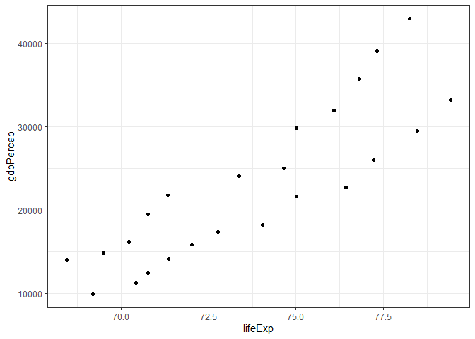
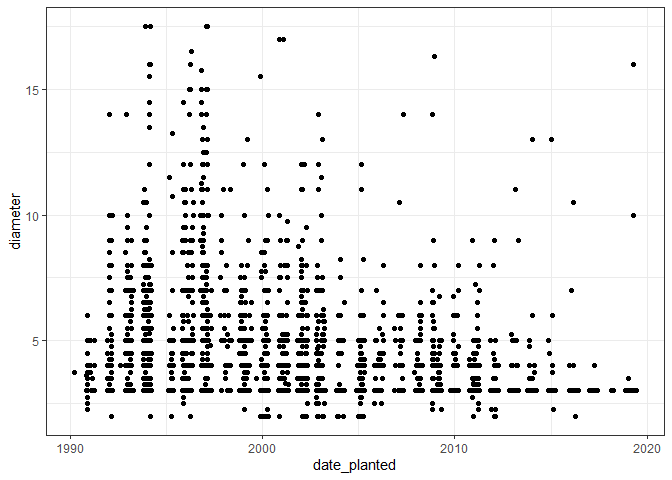
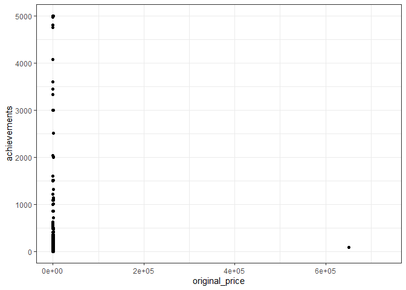
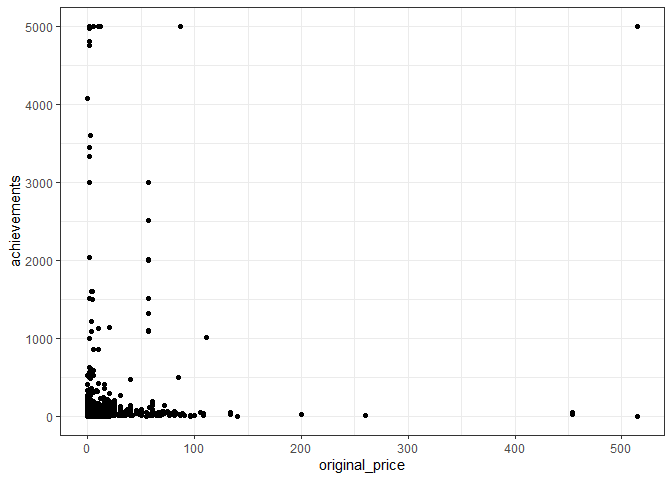

Assignment 1-B
================

**Deadline**: Saturday, November 7, 2020 at 23:59 PST

**Total Points**: 20

This assignment first covers making a function (Exercise 1, covered in
Week 1), then using list columns (Exercise 2, covered in Week 2) to
explore a data set.

  - [ ] For your convenience, we’ve indicated all action items with a
    checkbox, like so.

## Setup

1.  [x] Go to canvas to get your invitation to the STAT 545 homework
    GitHub Organization. You can find this in the description of
    Assignment 1-B.
2.  [x] Work within your `assignment-1b` folder in your new repository,
    and complete the assignment by filling in this very .Rmd file. Your
    repo will be seeded with instructions for this milestone. Commit and
    push your work early and often (although this will not be graded,
    many students end up in situations where they wish they pushed more
    frequently).

## Tidy Submission (2 points)

Follow these steps to submit your work. Be sure to familiarize yourself
with the rubric for a tidy submission below, before doing these steps.

1.  [ ] Make a README file in your `assignment-1b` folder. It should let
    a visitor know what’s in this folder.
2.  [ ] Make/update a main README file for your entire repository. It
    should orient a visitor to what this repository *is*, and that
    visitor should know how to engage with the repository. There should
    not be much here.
3.  [ ] Make your assignment appear nicely rendered and viewable online,
    such as by changing the output to `output: github_document` in the
    YAML header.
      - You could also use GitHub pages. But, the assignment needs to
        correspond to the tagged release, and we still need to be able
        to navigate to your repository somehow.
4.  [ ] Tag a release in your GitHub repository corresponding to your
    submission before the deadline.
      - Forgotten how to tag a release? We have instructions at the
        bottom of the [Collaborative Milestone 1
        repo](https://stat545.stat.ubc.ca/collaborative-project/milestone1/readme/)
        from STAT 545A.
5.  [ ] Grab the URL corresponding to your viewable output from Step 3,
    and submit that to canvas. Also, please let us know what you thought
    of this assignment – any feedback would be appreciated.

**Rubric**:

  - The above steps were followed.
  - Your work is self-contained in the `assignment-1b` folder.
  - Your work must be reproducible from beginning to end. That is, a
    member of the teaching team should be able to run all code
    error-free and reproduce the output files.
  - You use proper English, spelling, and grammar, and write concisely.
    If there’s any uncertainty in determining a grade here, the [UBC MDS
    writing
    rubric](https://github.com/UBC-MDS/public/blob/master/rubric/rubric_writing.md)
    will be referred to.
  - If there’s any further uncertainty in determining a grade for this
    tidy submission portion, the [UBC MDS mechanics
    rubric](https://github.com/UBC-MDS/public/blob/master/rubric/rubric_mech.md)
    will be referred to.

## Exercise 1: Functions (10 points)

In this exercise, you’ll be making a function and fortifying it. The
function need not be complicated. The function need not be “serious”,
but shouldn’t be nonsense.

**Function Ideas**

Basic:

  - Did you repeat any code for a data analysis in STAT 545A? If so,
    consider making a function for this action.
  - Write a *wrapper* around an existing function.
      - For example, perhaps accepting a narrower range of inputs (like
        not allowing logical vectors), or providing a different output.
      - A specific example: my [`rqdist()`
        function](https://github.com/vincenzocoia/rqdist/blob/master/R/rqdist.R#L1)
        is a wrapper around `quantreg::rq()`, narrowing its
        functionality.
      - It’s usually better to narrow a function’s focus than to
        broaden, so that a function doesn’t end up doing too much.
  - Make a function extracting parts of an `"lm"` object that you can’t
    easily access (`broom` aside), or measuring the “difference” between
    a linear and quadratic fit.
  - Make a special plot that you’d want to repeat when exploring your
    data.
  - You might find a function useful to apply for Exercise 2.

Advanced:

  - Make a new ggplot2 geom. Need inspiration? Fun ideas count –
    [`geom_lime()` and
    `geom_pint()`](https://github.com/coolbutuseless/geomlime) are great
    examples (thanks, Asfar, for finding this) – but it’s not enough to
    make something like `geom_parrot()` based on these functions,
    because there’s not enough original work to answer the questions we
    have for you.
  - Fit a Beverton-Holt model (or some other scientifically motivated
    parametric function) to some data via least squares or some other
    method.
  - [Create your own `broom` tidier
    function](https://www.tidymodels.org/learn/develop/broom/) for a
    model that’s currently incompatible with `broom` (warning: this uses
    S3 object oriented programming, but you don’t need to implement that
    for this assignment).

**Caveats**

The first three caveats are prone to a penalty of -1 point.

  - **Other sources**: We need to see your own work here. You *can* use
    someone’s function as inspiration for your function, just be sure to
    (1) reference the source of inspiration for your function, and (2)
    you should be able to answer the questions in this Exercise for your
    own work.
  - **Too simple**: Your function should involve more than just a
    calculation that you can do with operations like `+`, `-`, `*`, `/`,
    `&`, `<`, etc. – even with simple functions like `sqrt()` that have
    one argument only. But, add a feature like `trim` (as in the
    `mean()` function, if it makes sense to do so), and you have
    something that’s no longer simple. So, `function(x) x ^ 2` is too
    simple. But, `function(x) max(x) - min(x)` isn’t too simple, because
    the `max()` and `min()` functions have another option (`na.rm`).
  - **Nonsense**: The function should be sensible. Example of a nonsense
    function: `function(x, y) x ^ (x + y) + x / y ^ x - 1`.
  - **Making more than one function**: You might encounter this
    situation if a task is too big for one function, and you just
    wouldn’t be satisfied with yourself if you only made one function.
    If so, it sounds like you’re well on your way to making an R package
    in Week 3 (Assignment 2-B), so definitely keep the idea. We’ll only
    be grading one function for this assignment though, so if you make
    more than one, please let us know which one you’d like to be graded.

### 1.1 Documentation and Design (5)

| Rubric        | Description                                                                                      | Points |
| ------------- | ------------------------------------------------------------------------------------------------ | ------ |
| Documentation | Documentation is complete, according to the instructions.                                        | 1      |
| Focussed      | Your function doesn’t do too many actions – it does one thing, as described in your description. | 1      |
| Generalised   | *See below*                                                                                      | 2      |
| Format        | *See below*                                                                                      | 1      |

In the space below, document your function:

  - [x] **Description**: In 1-2 brief sentences, describe what the
    function does.
      - As a model answer, check out the “Description” section (the very
        first section) in the documentation of an R function that you
        know and love.
      - Technical language is OK (like “Generalised Linear Model”), but
        not a step-by-step written account of each line. If you feel the
        need to add more details, separate these details from the main
        description. In fact, many functions have a “Details” section in
        their documentation\! Just check out `lm()` as an example – but
        don’t go overboard like that.
  - [x] For each **argument**,
      - [x] Write the argument name.
      - [x] Describe the input: What restrictions are there – should it
        be a vector? A list? A specific type of vector, like numeric? If
        there’s a default value, specify what the default is.
      - [x] Briefly justify (1-2 sentences) your choice of name and (if
        applicable) default value.
  - [x] For the **output**:
      - [x] Describe the object that’s returned. Is it a vector? A list?
        Is it a numeric vector? What does the object represent?
      - [x] Briefly justify (1-2 sentences) your choice of output
        format.

Here’s an elaboration on the rubrics:

**Generalised**

Your function should not be specific to a decision that you made for an
analysis. Use function arguments to accomplish being able to use this
function in other analyses. The following examples are signs that you
need to use more arguments to generalise your function:

  - Your function should not rely on anything from your working
    environment.
  - Your function should not rely on “magic numbers” – pre-selected
    numbers (or options) that appear inside the function that can’t be
    accessed by a user of the function.
      - For example, maybe `quantile(x, type = 1, ...)` appears in your
        function. The choice of 1 is arbitrary.
      - That is, it’s arbitrary *unless* it’s specific to your function
        – `type = 1` corresponds to the empirical quantile, and this
        would be fine if your function is *designed* to calculate the
        empirical quantile.

Adding additional arguments sometimes means you’ll have to think outside
of the box as to how you’ll design your function, but that’s the fun
part.

  - At least three of the below are relevant/appropriate, and therefore
    found in your function (if not, your function may be too simple):
      - Appropriate `NA` handling, such as with `na.rm`, if relevant
        (usually relevant for *summarising* functions that would appear
        in `dplyr::summarise()` – typically not in vectorized functions
        that would appear in `dplyr::mutate()`).
      - Appropriate defaults are used, if relevant. (Your justification
        is considered here).
      - The ellipsis (`...`) is used as an “argument”, if
        relevant/appropriate.
      - A “special option” is included, to tweak the function’s
        behaviour. For example, the `trim` argument in the `mean()`
        function, or `type` in the `quantile()` function. Including this
        doesn’t count if this argument should be absorbed by the
        ellipsis (can’t double-dip the use of ellipsis and this option)
      - A second special option is included.

**Format**

What we’re looking for in terms of the **format** of the input and
output:

  - Arguments have appropriate names (you should at least have sound
    justification).
  - Input should not take a rigid form. An example that’s too rigid is a
    data frame that’s expected to have special types of columns.  
  - The output is consistent – for example, always gives a list. An
    example of inconsistent output: `sapply(1:3, seq_len)` gives a list,
    and `sapply(1:3, sqrt)` gives an (atomic) vector.
  - The structure of the input and output makes sense. Sometimes the
    input and output is a natural choice (as in the `sqrt()` function),
    and other times it’s not (as in the `lm()` function).
  - You’ve made use of data masking when it makes sense to do so, and
    used curly-curly (`{{ var }}`) in your function code.

-----

<!----------- Documentation goes here ---------------------->

**Description**

This function plots a scatter graph of two variables in a tibble, after
filtering for a certain keyword / string contained in a character column
of said tibble

**Input (Arguments)**

<<<<<<< HEAD
  - `data`: The tibble on which the function is being performed
=======
  - `data`: The tibble on which the function is being performed on
>>>>>>> f0c71b696169f5c72631713c21e0bbf50b76e897
      - *Justification*: Standard naming convention
  - `keyword`: The string that the keyword\_column will be filtered for
      - *Justification*: Name choice makes it clear what the input
        should be
  - `keyword_column`: The column that will be filtered to only include
    entries that contain the keyword. Input should be a character /
    factor column
      - *Justification*: Name choice makes it clear what the input
        should be
  - `x`: The column to use for the x-axis of the plot. Input should be a
    column that can be used for a scatter graph (eg numeric, datetime)
      - *Justification*: Standard naming convention
  - `y`: The column to use for the y-axis of the plot. Input should be a
    column that can be used for a scatter graph (eg numeric, datetime)
      - *Justification*: Standard naming convention
  - `xlogscale`: Option to use a log-scale on the x-axis, default =
    FALSE
      - *Justification*: Name choice makes it clear what the input
        should be. Default value is FALSE, as using a normal scale as
        default is clearly the logical choice
  - `ylogscale`: Option to use a log-scale on the y-axis, default =
    FALSE
      - *Justification*: As above
  - `xtrim`: Option to trim a certain proportion of the x-axis data
    (split across either end of the value range). Value should be
    between 0 and 1, default = 0
      - *Justification*: Name choice makes it clear what the input
        should be. Default value is 0, as trimming the data by a certain
        % as a default wouldn’t be logical
  - `ytrim`: Option to trim a certain proportion of the y-axis data
    (split across either end of the value range). Value should be
    between 0 and 1, default = 0
      - *Justification*: As above
  - `na.rm`: Choice of keeping or removing NA values, default = TRUE
      - *Justification*: Standard naming convention. Default value is
        TRUE, as ggplot will remove these entries anyway. Choice to keep
        NA values perhaps could be used if you wish to see how many
        entries were NAs etc
  - …

**Output**

The output of the function is a scatter plot using ggplot’s
`geom_point()`.

<<<<<<< HEAD
I don’t feel that this requires justification.
=======
No justification required.
>>>>>>> f0c71b696169f5c72631713c21e0bbf50b76e897

<!---------------------------------------------------------->

-----

### 1.2 Write the Function (3)

| Rubric   | Description                                                                  | Points |
| -------- | ---------------------------------------------------------------------------- | ------ |
| Accuracy | Does your function do what you intended it to do, as per your documentation? | 2      |
| Messages | Are your messages well-placed in the function, and informative?              | 1      |

  - [x] Write your function in the space below, in a code chunk.
  - [x] Implement at least one of these two message-bearing methods,
    using conditionals (`if` statements) to do so:
      - Add useful error messages or warnings: use the `stop()` or
        `warning()` function in an `if` statement. Ensure the message is
        informative. In one or two brief sentences: Why did you choose
        what you chose – i.e., warning or stop?
      - Add a `verbose` argument (counts as a “special argument” in
        1.2), taking a logical input, that keeps the user up-to-date
        with messages that print to screen as the function is running.
        This is mostly relevant for functions that could take a long
        time to run, but for this assignment, it’s OK for any multi-line
        function.

<!------------ Write your function below here -------------->

<<<<<<< HEAD
=======
First load the tidyverse package, used by the function:

>>>>>>> f0c71b696169f5c72631713c21e0bbf50b76e897
#### The function:

``` r
kw_scatter <- function(data, keyword, keyword_column, x, y, xlogscale = FALSE, ylogscale = FALSE,                             xtrim = 0, ytrim = 0, na.rm = TRUE, ...){
  
    if(!between(xtrim, 0, 1)) stop("Please choose an xtrim value between 0 and 1")
    if(!between(ytrim, 0, 1)) stop("Please choose an ytrim value between 0 and 1")

    data %>%
      filter(grepl(keyword, {{ keyword_column }})) %>%
      {if (na.rm) drop_na(., {{ x }}) else .} %>%
      {if (na.rm) drop_na(., {{ y }}) else .} %>%
      {if (xtrim) filter(., between({{ x }}, quantile({{ x }}, xtrim / 2), quantile({{ x }}, 1 - xtrim / 2))) else .} %>%
      {if (ytrim) filter(., between({{ y }}, quantile({{ y }}, ytrim / 2), quantile({{ y }}, 1 - ytrim / 2))) else .} %>%
      ggplot(aes({{ x }}, {{ y }})) +
      geom_point() +
      {if (xlogscale == TRUE) scale_x_log10()} +
      {if (ylogscale == TRUE) scale_y_log10()} +
      theme_bw()

}
```

I included the error to make sure the inputted trim values are between 0
and 1. A trim value of less than 0 would give an error anyway, however a
value of greater than 1 would not (it would, however, remove all the
data - making the output of the function redundant). I think this error
is useful, as it could be the case that someone who wanted to trim 5% of
their data might accidentally input the trim value as 5, not 0.05 as
required.

<!---------------------------------------------------------->

### 1.3 Test the Function (2 points)

| Rubric | Description                                                                                      | Points |
| ------ | ------------------------------------------------------------------------------------------------ | ------ |
| Choice | Your demonstrations aren’t redundant; neither are the tests; selected inputs are useful to check | 2      |

  - [x] Demonstrate the use of your function, using at least two
    non-redundant inputs.
<<<<<<< HEAD
  - [x] Write formal tests for your function. You should use at least
=======
  - [ ] Write formal tests for your function. You should use at least
>>>>>>> f0c71b696169f5c72631713c21e0bbf50b76e897
    three non-redundant uses of an `expect_()` function from the
    `testthat` package, and they should be contained in a `test_that()`
    function (or more than one).

Example of non-redundant inputs:

  - Vector with no NA’s
  - Vector that has NA’s
  - Vector of a different type (if relevant)
  - Vector of length 0, like `numeric(0)`.

Example of redundant inputs:

  - Each providing a different number (unless one of these numbers have
    some significance, like a limit point – just tell us if that’s the
    case)

<!------------ Test your function below here --------------->

<<<<<<< HEAD
=======
First load the packages for this section:

>>>>>>> f0c71b696169f5c72631713c21e0bbf50b76e897
#### Demonstration:

``` r
kw_scatter(data = gapminder, keyword = "United", keyword_column = country, x = lifeExp, y = gdpPercap)
```

<!-- -->

``` r
kw_scatter(vancouver_trees, "JAPANESE", common_name, date_planted, diameter, ytrim = 0.01)
```

<!-- -->

``` r
kw_scatter(data = steam_games, keyword = "Action", keyword_column = genre, x = original_price, y = achievements, na.rm = FALSE)
```

    ## Warning: Removed 10964 rows containing missing values (geom_point).

<!-- -->

``` r
kw_scatter(data = steam_games, keyword = "Action", keyword_column = genre, x = original_price, y = achievements, xtrim = 0.01)
```

<!-- -->

#### Function tests:

For these tests, I will use `expect_error()` twice:

  - First to make sure an error is thrown when xtrim \> 1
  - Next, the trim option should throw an error when used on a datetime
    object

I will then create a ggplot object from scratch below, and use
`expect_equal()` to make sure the corresponding `kw_scatter()` function
matches it

``` r
kw_test <- steam_games %>%
  filter(grepl("Action", genre)) %>%
  drop_na(original_price) %>%
  drop_na(achievements) %>%
  ggplot(aes(x = original_price, y = achievements)) +
  geom_point() +
  theme_bw()
```

Now the tests:

``` r
test_that("kw_scatter tests", {
  
  expect_error(kw_scatter(data = gapminder, keyword = "Dem.", keyword_column = country, x = lifeExp, y = gdpPercap, xtrim = 10))

  expect_error(kw_scatter(vancouver_trees, "JAPANESE", common_name, date_planted, diameter, xtrim = 0.01))
  
  expect_equal(kw_scatter(data = steam_games, keyword = "Action", keyword_column = genre, x = original_price, y = achievements), kw_test)
  
})
```

<!---------------------------------------------------------->

### 1.4 (**Optional**, 1 bonus point)

Contribute to an open-source R package on GitHub by making an
improvement to one of their functions, or perhaps even adding your
function to their package. If you’re nervous, maybe ask the developers
first via a GitHub Issue or email (check their `CONTRIBUTING` file for
more details, if they have one).

Note: You can’t get above 100% on this assignment.

If you choose to do this, just put a link to the pull request that you
made on the R package’s GitHub repository. Your pull request doesn’t
need to be accepted by the developers, but your pull request *should* be
realistic in order to get this bonus point.

**You can even do this after you submit the assignment**. For example,
you might want to wait until we learn about R packages before you do
this. If this is the case, just make sure to let your grader know once
you submit your pull request, via a GitHub Issue in your homework
repository (don’t forget to `@tag` them\!), also including a link to
your pull request. But, you have until the deadline of Assignment 5-B to
do this, and you only get one attempt\!

## Exercise 2: List Columns (8 points)

### 2.1 (8 points)

| Rubric      | Description                                             | Points |
| ----------- | ------------------------------------------------------- | ------ |
| First map   | First `purrr` mapping function was used correctly       | 2      |
| Second map  | Second `purrr` mapping function was used correctly      | 2      |
| (Un)nesting | Was done appropriately                                  | 2      |
| Explanation | What was claimed to be calculated was indeed calculated | 2      |

For this exercise, you’ll be evaluating a model that’s fit separately
for each group in some dataset.

Examples:

  - Maybe your model is a linear model (using `lm()`) for each continent
    in the `gapminder::gapminder` dataset.
  - Maybe your model is a distribution of a single variable (using the
    [`distplyr` package](https://distplyr.netlify.app/)) for each
    penguin in the `palmerpenguins::penguins` dataset.

Your tasks are as follows.

<<<<<<< HEAD
1.  [x] Make a column of model objects. Do this using the appropriate
=======
1.  [ ] Make a column of model objects. Do this using the appropriate
>>>>>>> f0c71b696169f5c72631713c21e0bbf50b76e897
    mapping function from the `purrr` package. Note: it’s possible
    you’ll have to make use of nesting, here.
      - For `distplyr`, use a `distplyr::dst_*()` function of your
        choosing, like `dst_norm()` or `dst_step()`. Note that there
        aren’t that many `dst_*()` functions yet, sorry – `distplyr` is
        still quite young.
<<<<<<< HEAD
2.  [x] Evaluate the model in a way that interests you. But, you should
=======
2.  [ ] Evaluate the model in a way that interests you. But, you should
>>>>>>> f0c71b696169f5c72631713c21e0bbf50b76e897
    evaluate something other than a single number for each group. Hint:
    you’ll need to use another `purrr` mapping function again.
      - For `distplyr`, use a distributional representation of your
        choosing, such as quantiles, using the appropriate
        `distplyr::enframe_*()` function.
<<<<<<< HEAD
3.  [x] Print out the tibble so far.
4.  [x] Unnest the resulting calculations, and print your final tibble
    to screen. Make sure your tibble makes sense: column names are
    appropriate, and you’ve gotten rid of columns that no longer make
    sense.
5.  [x] Don’t just blindly do this exercise: in 1-2 brief sentences,
=======
3.  [ ] Print out the tibble so far.
4.  [ ] Unnest the resulting calculations, and print your final tibble
    to screen. Make sure your tibble makes sense: column names are
    appropriate, and you’ve gotten rid of columns that no longer make
    sense.
5.  [ ] Don’t just blindly do this exercise: in 1-2 brief sentences,
>>>>>>> f0c71b696169f5c72631713c21e0bbf50b76e897
    tell us what you’ve just calculated, and in what column.

<!------------ Put your work here -------------------------->

<<<<<<< HEAD
I will be fitting a logistic regression model for each of the three
types of penguin, trying to predict the sex of the penguins based on all
the variables corresponding to measurements (`bill_length_mm`,
`bill_depth_mm`, `flipper_length_mm` and `body_mass_g`).

I will drop all NA values for the sex of the penguins, and convert the
male / female entries into a binary 1 / 0 (this will help me later when
conducting analysis on the results).

``` r
(penguins_model <- penguins %>%
  drop_na(sex) %>%
  mutate(sex_group = ifelse(sex == 'female', 0, 1)) %>%
  select(!c("sex", "island", "year")) %>%
  nest(data = !species) %>%
  mutate(model = map(data, ~ glm(sex_group ~ bill_length_mm + bill_depth_mm + flipper_length_mm + body_mass_g, data = ., family = binomial))))
```

    ## # A tibble: 3 x 3
    ##   species   data               model 
    ##   <fct>     <list>             <list>
    ## 1 Adelie    <tibble [146 x 5]> <glm> 
    ## 2 Gentoo    <tibble [119 x 5]> <glm> 
    ## 3 Chinstrap <tibble [68 x 5]>  <glm>

Now we have the generalized linear model, I will use the `augment()`
function to show the fitted values of the model. These values are
numbers between 0 and 1, corresponding to the probability given by the
model that the entry belongs to `sex_group` 1 (ie the probability that
the penguin is male).

``` r
(penguins_model_results <- penguins_model %>%
  transmute(species, yhat = map(model, function(x) augment(x, type.predict = "response"))) %>%
  unnest(yhat) %>%
  select(!c('.resid', '.std.resid', '.hat', '.sigma', '.cooksd')))
```

    ## # A tibble: 333 x 7
    ##    species sex_group bill_length_mm bill_depth_mm flipper_length_~ body_mass_g
    ##    <fct>       <dbl>          <dbl>         <dbl>            <int>       <int>
    ##  1 Adelie          1           39.1          18.7              181        3750
    ##  2 Adelie          0           39.5          17.4              186        3800
    ##  3 Adelie          0           40.3          18                195        3250
    ##  4 Adelie          0           36.7          19.3              193        3450
    ##  5 Adelie          1           39.3          20.6              190        3650
    ##  6 Adelie          0           38.9          17.8              181        3625
    ##  7 Adelie          1           39.2          19.6              195        4675
    ##  8 Adelie          0           41.1          17.6              182        3200
    ##  9 Adelie          1           38.6          21.2              191        3800
    ## 10 Adelie          1           34.6          21.1              198        4400
    ## # ... with 323 more rows, and 1 more variable: .fitted <dbl>

Now we can check how accurate this model actually is. We define the
variable `.error` to be the absolute difference between the `sex_group`
and `.fitted` variables.

For example, if we decided to impose no confidence restrictions, and
just assign a penguin to the ‘male’ group if the `.fitted` value was
greater than 0.5, and to the ‘female’ group if less than 0.5, then a
`.error` of greater than 0.5 indicates that this was an incorrect
assignment.

I will create the `prediction_check` column, which gives 1 if the
assigment was correct, and 0 if not.

``` r
(penguins_model_accuracy <- penguins_model_results %>%
  select(species, sex_group, .fitted) %>%
  mutate(.error = abs(sex_group - .fitted)) %>%
  mutate(prediction_check = ifelse(.error > 0.5, 0, 1)))
```

    ## # A tibble: 333 x 5
    ##    species sex_group .fitted    .error prediction_check
    ##    <fct>       <dbl>   <dbl>     <dbl>            <dbl>
    ##  1 Adelie          1  0.842  0.158                    1
    ##  2 Adelie          0  0.619  0.619                    0
    ##  3 Adelie          0  0.0639 0.0639                   1
    ##  4 Adelie          0  0.0887 0.0887                   1
    ##  5 Adelie          1  0.963  0.0366                   1
    ##  6 Adelie          0  0.336  0.336                    1
    ##  7 Adelie          1  1.00   0.0000594                1
    ##  8 Adelie          0  0.0776 0.0776                   1
    ##  9 Adelie          1  0.990  0.00967                  1
    ## 10 Adelie          1  0.996  0.00368                  1
    ## # ... with 323 more rows

Now, for each penguin type, we can take the mean of the
`prediction_check` column to see how accurate the model was.

``` r
penguins_model_accuracy %>%
  group_by(species) %>%
  summarise(mean(prediction_check))
```

    ## `summarise()` ungrouping output (override with `.groups` argument)

    ## # A tibble: 3 x 2
    ##   species   `mean(prediction_check)`
    ##   <fct>                        <dbl>
    ## 1 Adelie                       0.932
    ## 2 Chinstrap                    0.912
    ## 3 Gentoo                       0.958

The model performed best for Gentoo penguins, with 95.8% of predictions
correct, and worst for Chinstrap penguins, with 91.2% correct.

=======
>>>>>>> f0c71b696169f5c72631713c21e0bbf50b76e897
<!---------------------------------------------------------->

### 2.2 (**Optional**, 1 bonus point)

Choose one of the following. Following a linear model fit to groups on
the gapminder dataset, either:

  - Find countries with interesting stories. Sudden, substantial
    departures from the temporal trend is interesting. How could you
    operationalize this notion of “interesting”?
  - Use the residuals to detect countries where your model is a terrible
    fit. Examples: Are there 1 or more freakishly large residuals, in an
    absolute sense or relative to some estimate of background
    variability? Are there strong patterns in the sign of the residuals?
    E.g., all positive, then all negative, then positive again.
  - Fit a regression using ordinary least squares and a robust
    technique. Determine the difference in estimated parameters under
    the two approaches. If it is large, consider that country
    “interesting”.
