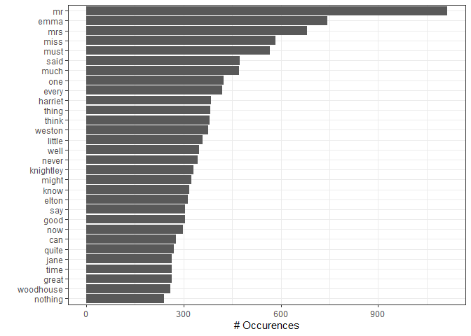

Assignment 5-B Answers
================
Tim Crowe

  - **Leader**: Victor Yuan

  - **Reviewer**: Diana Lin & Vincenzo Coia

  - **Deadline**: Saturday, December 12, 2020 at 23:59 PST

  - **Total Points**: 20

## Option A – Strings in R

Complete the following two exercises using concepts and tools covered in
class (i.e. `stringr`, regex, tidyverse, etc.)

### Exercise 1 (9 points)

*Take a Jane Austen book contained in the `janeaustenr` package, or
another book from some other source. Make a plot of the most common
words in the book, removing “stop words” of your choosing (words like
“the”, “a”, etc.) or stopwords from a pre-defined source, like the
`stopwords` package or `tidytext::stop_words`.*

I will be analysing the book “Emma” by Jane Austen to find the most
common words. For the “stop words”, I will use the `stopwords` package.

The `janeaustenr` package provides a character vector which contains the
entire text of the novel “Emma” (along with her other novels). In order
to do the analysis on this novel, I will remove all punctuation and
change all upper case characters to lower case.

I will then create a tibble in which every single word in the novel is
it’s own row, and remove all the words contained in the list mentioned
previously in order to show what the most common words in the novel are.

Step by step annotations of what I am doing is provided in the code:

``` r
# use stopwords package and take default list of words to remove from the results
stopwords_list <- stopwords(language = "en", source = "snowball", simplify = TRUE)

# remove punctuation and convert all letters to lower case
emma_words_simplified <- emma %>%
  str_remove_all("[^ a-zA-Z]") %>%
  str_to_lower()

# create tibble for dplyr analysis
emma_tibble <- enframe(emma_words_simplified, value = "Text")

# modify tibble to get desired list of most common words in the book
emma_common_words <- emma_tibble %>%
  separate_rows(Text, sep = " ") %>% # make each word in text be it's own row
  rename(Word = Text) %>%
  filter(Word %in% stopwords_list == FALSE) %>% # remove words from the stoplist
  filter(Word != "") %>% # remove empty entries
  count(Word) %>%
  arrange(desc(n))
```

Now we have a tibble of all the unique words in the novel, except those
found in `stopwords_list`, in descending order from most common to
least. A plot of the 30 most common words follows:

``` r
emma_common_words %>%
  top_n(30) %>%
  ggplot(aes(x = reorder(Word, n), y = n)) +
  geom_bar(stat = "identity") +
  coord_flip() +
  labs(y = "# Occurences", x = "") +
  theme_bw()
```

    ## Selecting by n

<!-- -->

### Exercise 2 (9 points)

*Make a function that converts words to your own version of Pig Latin.*

*The specific input and output that you decide upon is up to you. Don’t
forget to implement good function-making hygiene: we’ll be looking for
documentation (being sure to describe your Pig Latin conversion),
examples of applying the function, 3 non-redundant tests, appropriate
use of arguments, and appropriate amount of checking for proper input.*

*Your Pig Latin should incorporate two components:*

**Rearrangement component**

*The default Pig Latin rearrangement rule, [as per
Wikipedia](https://en.wikipedia.org/wiki/Pig_Latin#Background), moves
beginning letters to the end:*

> 1.  For words that begin with consonant sounds, all letters before the
>     initial vowel are placed at the end of the word sequence.
> 2.  When words begin with consonant clusters (multiple consonants that
>     form one sound), the whole sound is added to the end
> 3.  For words beginning with vowel sounds, one removes the initial
>     vowel(s) along with the first consonant or consonant cluster.

*Modify this somehow. Maybe you move letters from the end to the
beginning, or you change the rules altogether, keeping a similar level
of complexity.*

**Addition component**

*The default Pig Latin addition rule is to add “ay” to the end of the
word, after rearranging the letters of the word. You should choose some
other addition rule.*
